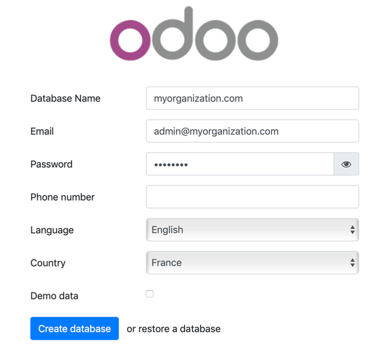

# odoo-dev   

An Odoo:12.0 development container powered by Docker

## Requirement

Prior to using the container, you will need to install Docker.

Visit [Docker Website](https://docker.com) for more detail.

## Docker resources created

The following images will be created:
  - [odoo:12.0](https://hub.docker.com/_/odoo)
  - [postgres:11.0](https://hub.docker.com/_/postgres)

The following local volumes:
  - odoo-dev-data (Odoo application server static data)
  - odoo-dev-db-data (Postgres database data)

The following network will be created:
  - odoo-dev-network

The following posts will be open (accessible on from lcalhost):
  - 8069/tcp (to access the web interface)

It will create a `addons` folder.

## Installation

First copy the config file:

	$ cp ./config/odoo.cong.dist ./config/odoo.conf

You are just one terminal command away from having an Odoo environment running:

	$ docker-compose up -d
	Creating network "odoo-dev-network" with the default driver
	Creating volume "odoo-dev-data" with default driver
	Creating volume "odoo-dev-db-data" with default driver
	Pulling postgres (postgres:11.0)...
	11.0: Pulling from library/postgres
	f17d81b4b692: Pull complete
	c1f213be5edb: Pull complete
	9c79723dc510: Pull complete
	603a66804109: Pull complete
	b4f1b901e523: Pull complete
	99d9650419de: Pull complete
	02d87bb25bad: Pull complete
	333a24caa91e: Pull complete
	2ace4c87570a: Pull complete
	3add70ce5596: Pull complete
	947f7d36d500: Pull complete
	5e194c53f09f: Pull complete
	e0d520465b2d: Pull complete
	97f206959126: Pull complete
	Digest: sha256:76ff79d72ef95b7c136037c0e8ab629914a8d5e430a3a2aef7d959b5da9a33c5
	Status: Downloaded newer image for postgres:11.0
	Pulling odoo (odoo:12.0)...
	12.0: Pulling from library/odoo
	9cc2ad81d40d: Pull complete
	65d4e50b1942: Pull complete
	7c3d2244567d: Pull complete
	ad8faf5acf89: Pull complete
	c63bc42e40a1: Pull complete
	2a078b59fef0: Pull complete
	21777eded183: Pull complete
	1ac8457b01b1: Pull complete
	9ccdec90eade: Pull complete
	9e185da7ca85: Pull complete
	Digest: sha256:1382ba4655224573d98cda020a30027e3de3ad5b53103b91ebadcd492c185dc4
	Status: Downloaded newer image for odoo:12.0
	Creating odoo-dev-db ... done
	Creating odoo-dev    ... done

Once the command has run, you can check if the process are run:

	$ docker ps

	CONTAINER ID        IMAGE                   COMMAND                  CREATED             STATUS                PORTS                                                                             NAMES
	c884f6d0161c        odoo:12.0               "/entrypoint.sh odoo"    About a minute ago   Up About a minute     0.0.0.0:8069->8069/tcp, 0.0.0.0:8071->8071/tcp                                    odoo-dev
	6a4f5fc0b65d        postgres:11.0           "docker-entrypoint.s…"   About a minute ago   Up About a minute     5432/tcp                                                                          odoo-dev-db

You can know connect to your freshly install [odoo-dev](http://localhost:8069) environment, and create the first database:

You can later manage your database via the [Database Manager](http://localhost:8069/web/database/manager).

If you wish to do so, you can set the master password for the database by updating the odoo server configuration (the instance need to be stopped). To do so open the `./config/odoo.conf` file and uncomment the `admin_passwd` line and set it to the wanted password.

	admin_passwd = <my_new_password>

	

## Control the containers

To start the containers, run:

	$ docker start odoo-dev odoo-dev-db
	odoo-dev
	odoo-dev-db

To stop the containers, run:

	$ docker stop odoo-dev odoo-dev-db
	odoo-dev
	odoo-dev-db.

To start a terminal on the `odoo-dev` (or `odoo-dev-db`), run:

	$ docker exec -it odoo-dev /bin/bash
	odoo@c884f6d0161c:/$

Use the `exit` command (or `ctrl-D`) to close the terminal.

## Build a module

To create a module, run the following command:

	docker exec -it odoo-dev /usr/bin/odoo scaffold <MODULE_NAME> /mnt/extra-addons

It should initialse a module in the `addons` folder. Fire up you favorite source code editor (LiClipse, Atom, VisualStudio Code or a good old vim/notepad/nano) and build that module. You can also follow this (tutorial)[https://www.odoo.com/documentation/12.0/howtos/backend.html#].

## Uninstall

Stop `odoo-dev` and `odoo-dev-db` containers

	$ docker stop odoo-dev odoo-dev-db
	odoo-dev
	odoo-dev-db

Delete the containers:

	$ docker container rm odoo-dev odoo-dev-db
	odoo-dev
	odoo-dev-db

Delete the network:

	$ docker network rm odoo-dev-network
	odoo-dev-network

Delete the images (if they are not used by other containers):

	$ docker image rm odoo:12.0 postgres:11.0
	Untagged: odoo:12.0
	Untagged: odoo@sha256:1382ba4655224573d98cda020a30027e3de3ad5b53103b91ebadcd492c185dc4
	Deleted: sha256:f0344a8a0d80e367b9dca3631db7c7c3cd58ad3ab32d2cb103b8a102a59f6802
	Deleted: sha256:047303f4a28f3af5f093eab1b7e91e1705f26cff0b6fcab0121fe76cd0989055
	Deleted: sha256:e9ea58a2b10cde6b3327dad0d7a36ffcbdb121a93ddd979e0afde80c6cd68a4f
	Deleted: sha256:abb61edca08454938c35d09909e09b167eb11cf02fb33f6cd0a2721805d119c4
	Deleted: sha256:3636afce585c091f4a005738626f068ef27571a6f74fb859b05a58505715fad3
	Deleted: sha256:5af0f6a023d826a4a5228fb19197191c9158dbf334a0bdca24dfd0717aacc494
	Deleted: sha256:477f173f04de65ee2d015f734f0e54180752500e7d0db4fdc7a143aee74a2dab
	Deleted: sha256:5770cb34dd474926a80ecfbc1008f83ba6a9e4880b72c6db1d500269923e95dd
	Deleted: sha256:8cc4d3386c05d880d2cb9ae652f573ccb13f36173acd5b26932f1673621f582b
	Deleted: sha256:653c4527f650e98e1602b81eb4179089f550a4b88da3d36bd26371bd68262346
	Deleted: sha256:f73e7e79899a33b4b9b78da62efb71520844f8dd518f3c390e27bc3063bce307
	Untagged: postgres:11.0
	Untagged: postgres@sha256:76ff79d72ef95b7c136037c0e8ab629914a8d5e430a3a2aef7d959b5da9a33c5
	Deleted: sha256:7a2907672aabc8acef32a62a1e0af63bc3e461377376a9201e45a87be3f075c2
	Deleted: sha256:4f0498486d638d4304f0b7af832fc6559525c4b206a36faf1097947a80a2a1e4
	Deleted: sha256:e741013c0844b980ed21bcd395c10f62c28af7d0928600046876cd7db5bfecd4
	Deleted: sha256:9f11e0c5e2cb7e1f6943c56e3e0f7fa50b0605bf609b5ecc17c55e093f6210ee
	Deleted: sha256:51bd4292e00ca5e8c01beaf5762edcbdf33ba2b32a1748c82f90645921f93551
	Deleted: sha256:5cae47639063af1a5ca8b0753d8c0e47ec06d14bedec0570ce27dcdb74e69749
	Deleted: sha256:4ce4ffc86f5bba59cd45d2c2105db736ba16cd2a78fc0f68477a55f5660dce3e
	Deleted: sha256:a81b206adc79380762861942645d727812de01673cb34e9ddb8539b4b2e2beb3
	Deleted: sha256:075fe85338030f494f58cd0eeb68ba99a47ed92889c0016b66200db8786db164
	Deleted: sha256:25bfa389a69262c9ce7376477ee812ecc53e6a1dc42949d89a4528273f4803e6
	Deleted: sha256:dd4da6ec23db0935ead485c2bb3042e10ea78de16de6f10a305057a850207f1b
	Deleted: sha256:fb8b681f57f1194aa621ab8aa52b6d42fef6639f41943f862e612ce0af7b7bac
	Deleted: sha256:f0933d1aa5b9878847d553108d54464bbae83018f88da834166a222037cad51a
	Deleted: sha256:5d6b817207767d5df5b188c683c726507dc09721ad4b91950b63b8e7a2eb300a
	Deleted: sha256:237472299760d6726d376385edd9e79c310fe91d794bc9870d038417d448c2d5

**Warning**: At that point you haven't messed up the data. The rest will delete the database and the addons:

Delete the volumes:

	$ docker volume rm odoo-dev-data odoo-dev-db-data
	odoo-dev-data
	odoo-dev-db-data

Finaly, you can delete the `odoo-dev` folder.

## License

Though I provide this Docker environment to development on Odoo with an MIT License, Odoo, Postgres and all other softwares included on the images have their own license.
	
